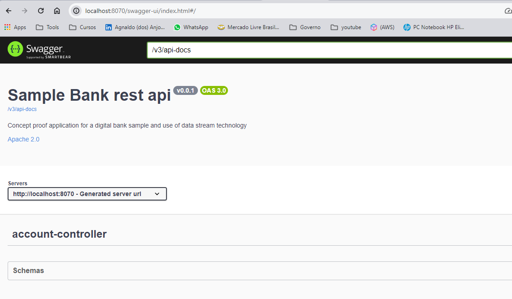

# Documento de Referência

## Introdução

Este documento apresenta um estudo de caso focado no desenvolvimento de uma solução escalável e observável, com suporte a cache e otimização de tempos de resposta, visando alta resiliência. Projetado para lidar com cenários de falha ou indisponibilidade na comunicação com órgãos reguladores, o estudo explora uma arquitetura distribuída baseada em microserviços. Essa arquitetura facilita a recepção, processamento e entrega de dados em situações de contingência, assegurando a continuidade dos serviços mesmo em face de inacessibilidade às APIs dos órgãos reguladores.

Para enfrentar esses desafios, adotou-se uma arquitetura distribuída com microserviços e data stream, promovendo desacoplamento de componentes e permitindo escalabilidade horizontal eficiente.

## Estudo de Caso

Desenvolveu-se um conjunto de APIs que simulam a funcionalidade de um banco digital, abrangendo interações com sistemas internos e comunicação com órgãos reguladores, como o Bacen. Os requisitos funcionais incluíram consulta de saldo, transferências entre contas, consulta a APIs externas de dados de referência, e registro de transações de transferência em órgãos reguladores, demonstrando a aplicabilidade prática da solução proposta.

### Diagramas no Modelo C4

#### Contexto da Solução


Descrição: Este diagrama ilustra o contexto geral da solução, destacando os principais usuários e sistemas externos envolvidos.

#### Containers da Solução


Descrição: Este diagrama detalha os containers que compõem a arquitetura da solução, mostrando como os microserviços interagem entre si e com sistemas externos.

## Escolhas Tecnológicas

A solução emprega Java 17 e Spring Boot (versão 3.2.2), com Resilience4j para implementação de circuit breaker e rate limiter, Caffeine para cache, PostgreSQL como banco de dados, e Flyway para gestão de migrations. A escolha dessas tecnologias visa promover robustez, eficiência e facilidade de manutenção.

A arquitetura é composta por três microserviços principais (`account-api`, `account-kernel`, `account-contingency`), que se comunicam via Apache Kafka, enfatizando a escalabilidade e a resiliência do sistema.

## Configuração Local do Projeto

### Como Baixar o Projeto

Clone o repositório do projeto usando o seguinte comando:

```
git clone https://github.com/agnaldoanjosclash/bank-services.git
```

### Inicialização do Ambiente

Para configurar o ambiente local, utilize o Docker Compose do projeto `account-kernel`. Acesse a raiz do projeto e execute:

```
cd .../bank-services/account-kernel
docker-compose up -d
```

O ambiente inclui Zookeeper, Apache Kafka, PostgreSQL, e Wiremock para simulação dos serviços de cadastro e registro no Bacen, facilitando o desenvolvimento e testes locais.

## Documentação das APIs

A documentação das APIs é acessível via Swagger nos seguintes endereços:

- **account-kernel**: [Swagger UI - Kernel](http://localhost:8090/swagger-ui/index.html#/)
- **account-api**: [Swagger UI - API](http://localhost:8070/swagger-ui/index.html#/)

As interfaces do Swagger proporcionam uma visão interativa das APIs, permitindo a execução de testes diretos através do navegador.

### Telas

#### account-kernel


#### account-api


**Nota:** O `account-contingency` é uma aplicação simples, focada na contingência através do consumo de tópicos do Kafka para registro de operações. Sua simplicidade e função específica dispensam documentação detalhada.

## Próximos Passos

Para testes, disponibilizamos uma collection do Postman:

```
.../bank-services/documents/sample-bank.postman_collection.json
```


## Testes unitários

É recomendado a exploração dos componentes através de testes unitários disponíveis em cada projeto, facilitando o entendimento do funcionamento